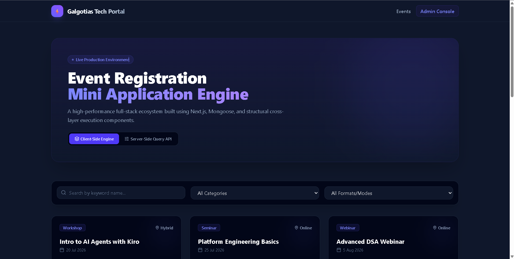
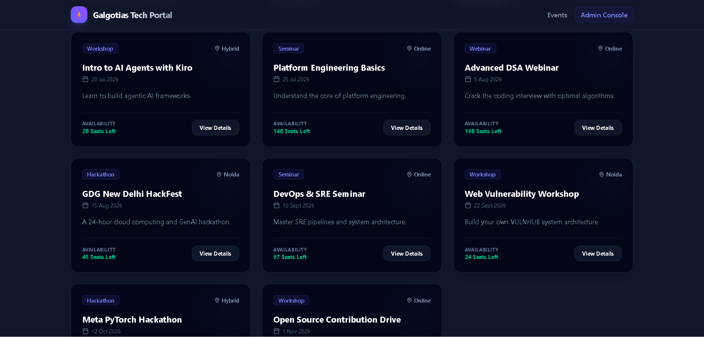
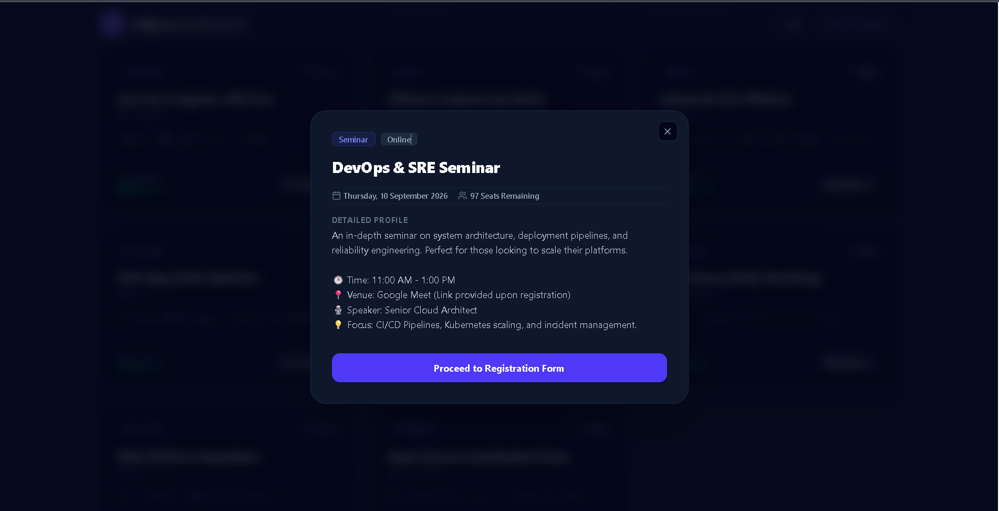
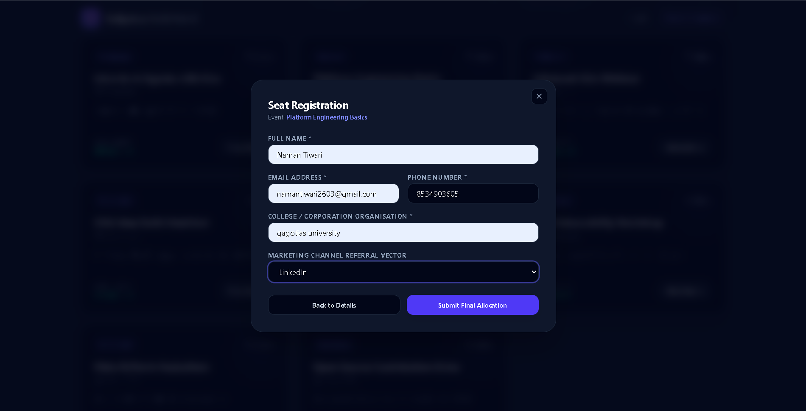
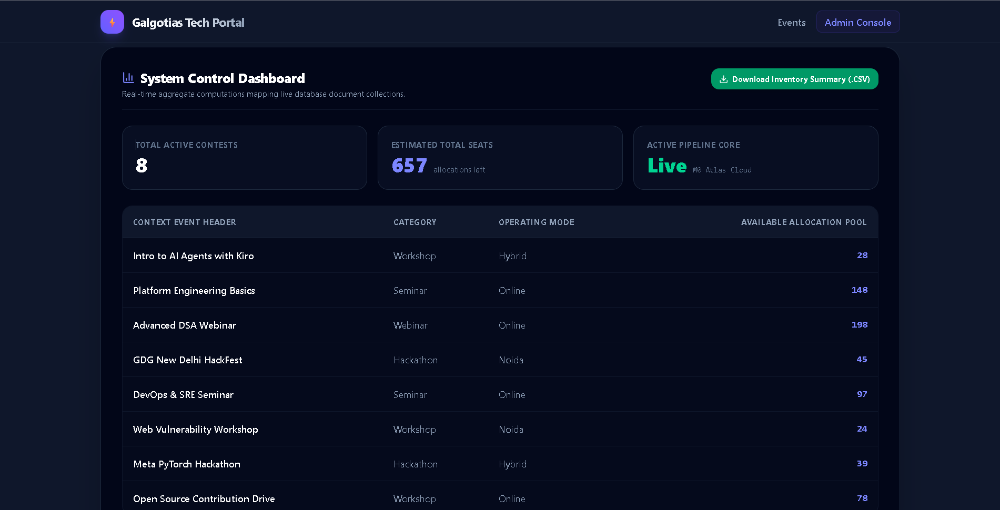

# TechPulse: Event Registration Full-Stack Engine

A high-performance event registration mini-application built to demonstrate full-stack integration, responsive UI/UX, and dual-layer filtering strategies.

## 📸 Project Showcase

| Interface | View |
| :--- | :--- |
| **Main Dashboard** |  |
| **Event Catalog** |  |
| **Event Details** |  |
| **Registration Form** |  |
| **System Admin Control** |  |

## 🚀 Key Technical Features
* **Frontend:** Next.js 14+ (App Router), Tailwind CSS (v4), Lucide Icons
* **Backend:** Next.js API Route Handlers
* **Database:** MongoDB Atlas + Mongoose ODM
* **Analytics:** Custom `trackEvent` engine logging user behavior (Views, Searches, Filters, Registrations) to the browser console.
* **Architecture:** Supports dual-layer filtering (Client-side React State vs. Server-side API Queries) with a 400ms debounce hook.
* **Security & Admin:** Secured Admin Console (Password: `admin123`) with CSV data export capability.

## ⚙️ Local Setup Instructions
1. Clone the repository and navigate into the project folder.
2. Install dependencies:
   \`npm install\`
3. Create a \`.env.local\` file in the root directory and add your MongoDB connection string:
   \`MONGODB_URI="mongodb+srv://<user>:<password>@cluster.../?appName=Cluster0"\`
4. Start the development server:
   \`npm run dev\`
5. **CRITICAL FIRST STEP:** Open your browser and navigate to \`http://localhost:3000/api/seed\` to instantly populate the database with the required 8 events and 10 mock registrations.
6. Return to \`http://localhost:3000\` to view the app!

## 📊 Analytics Tracking Strategy
To fulfill the analytics tracking requirement, I built a custom `trackEvent()` utility function (`src/lib/analytics.ts`) that logs user behaviors directly to the browser console.

**Events Tracked & Triggers:**
* \`event_list_viewed\`: Fires on initial page load (Component Mount).
* \`event_search_performed\`: Fires when a user types in the search box (protected by a 400ms Debounce hook to prevent API spam).
* \`event_filter_applied\`: Fires when a user selects a Category or Mode dropdown.
* \`event_card_clicked\`: Fires when "View Details" is clicked.
* \`registration_submitted\`: Fires when the form submit button is pressed.
* \`registration_success\` / \`registration_failed\`: Fires based on the API response payload.

*Product Thinking:* Tracking these specific funnels allows product managers to see where users drop off. For example, if we see high \`event_card_clicked\` logs but low \`registration_submitted\` logs, it tells us the event descriptions aren't convincing enough, or the form is too long.

## 🛡️ Bonus Features Implemented
* **Debounced API Search:** Custom `useDebounce` hook prevents API flooding during server-side filtering.
* **Dashboard Authentication:** The metrics dashboard is protected by a basic gatekeeper (Password: `admin123`).
* **CSV Generation:** Admin users can download a real-time Excel/CSV sheet of active event inventory.
* **TypeScript:** Strict interface typing across both Mongoose models and React components.

## 🐛 Debugging & Known Issues
* **PostCSS/Tailwind Build Error:** Encountered a configuration mismatch during Vercel deployment where Tailwind styles were not being injected. Resolved by migrating to the latest Tailwind v4 PostCSS integration (@tailwindcss/postcss) and updating global CSS import syntax.

* **Next.js Async Params:** Faced an Error: Route used params.id crash. Debugged by unwrapping the params object as a Promise to align with Next.js 15+ architectural requirements.

* **Environment Variable Configuration:** Initial database connectivity issues were resolved by strictly whitelisting the deployment IP and ensuring the MONGODB_URI environment variable was correctly injected via the Vercel Dashboard.